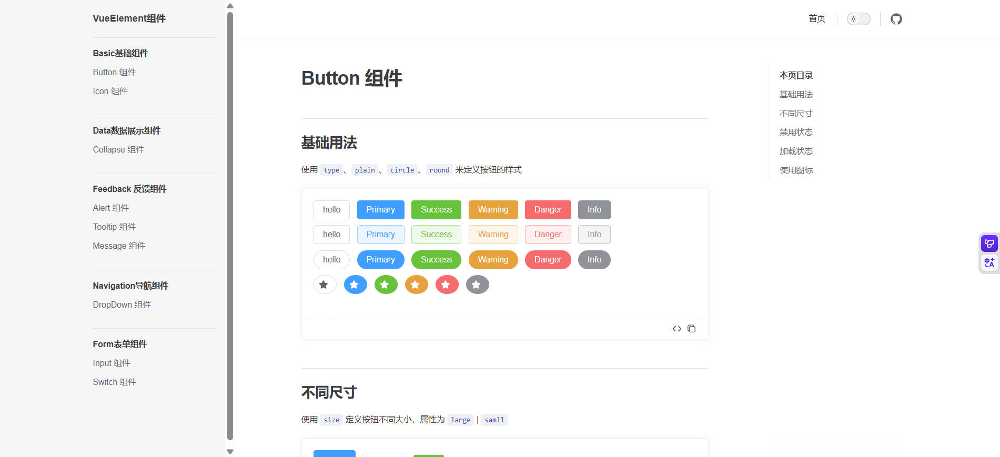
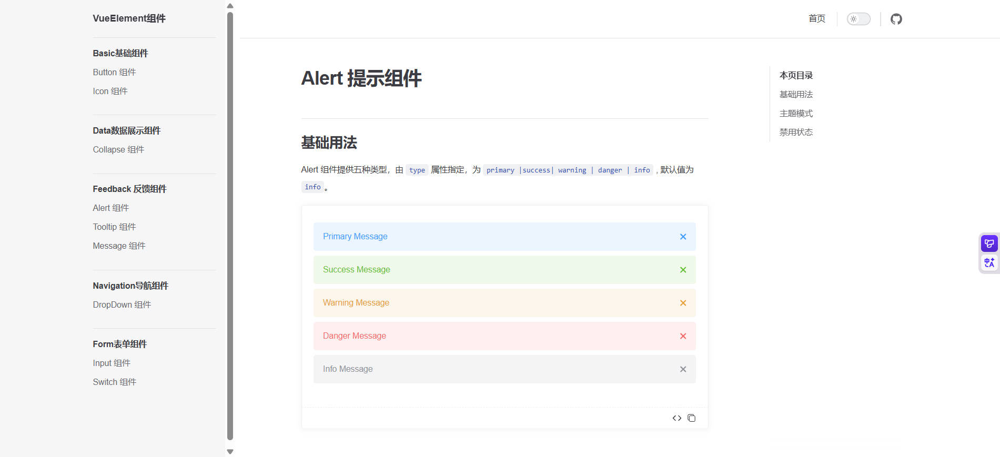
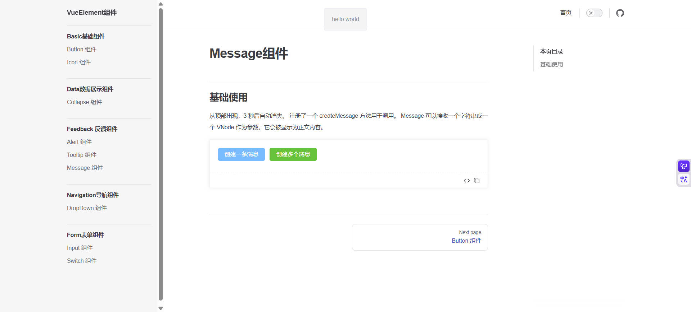

# VueEle

## 项目简介

这是一个仿照ElementPlus的组件库，基于Vue开发，轻量、高度自定义，服务于企业级的后台管理系统项目。
在线项目地址：https://vcui-zzys-projects-520709aa.vercel.app/

## 项目运行

```
npm install
npm run dev
npm run build
npm run lint
npm run docs:dev  #文档库运行
```

## 组件示例

### Basic基础组件

#### Button 组件



#### Icon 组件


### Data数据展示组件

#### Collapse 组件


### Feedback 反馈组件

#### Alert 组件



#### Tooltip 组件


#### Message 组件



### Navigation导航组件

#### DropDown 组件


### Form表单组件

#### Input 组件


#### Switch 组件


